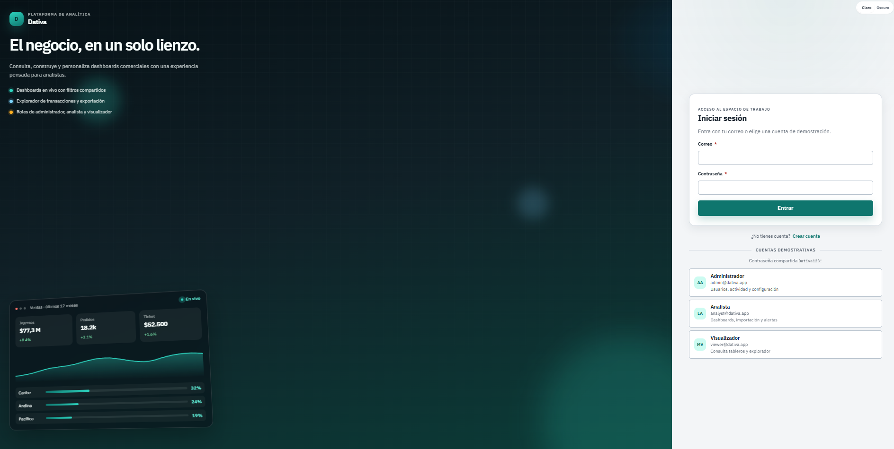
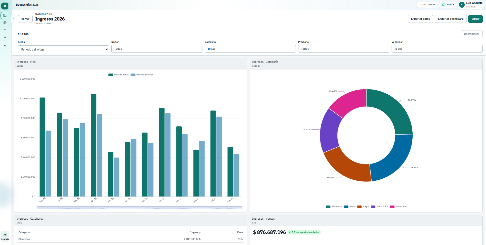
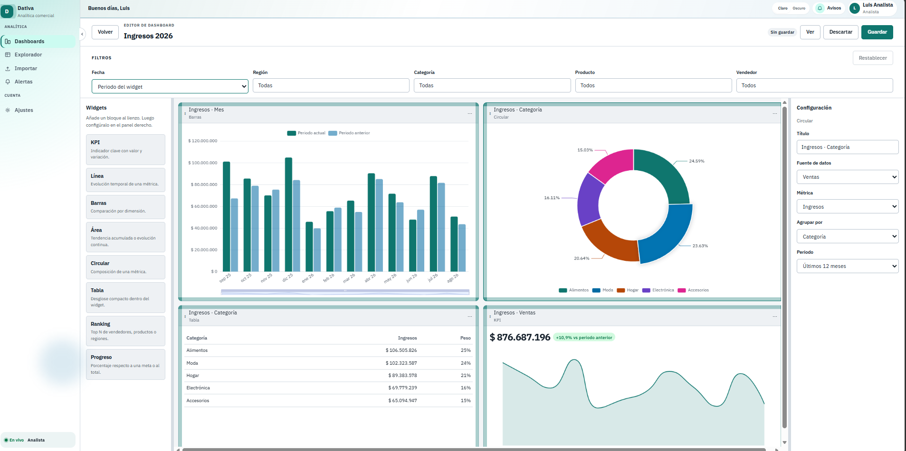
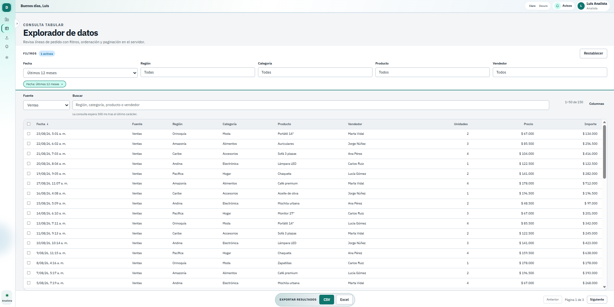
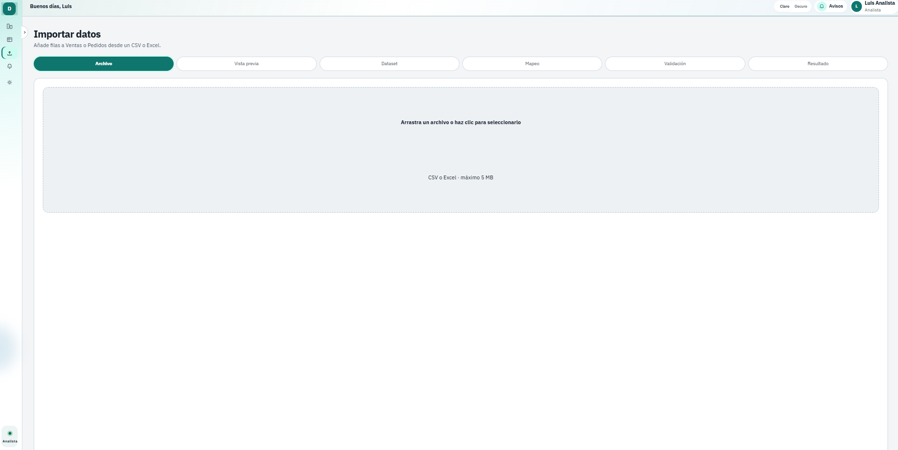

# **Dativa — Plataforma de analítica comercial**

Una aplicación full stack de analítica para equipos comerciales: dashboards con widgets, explorador de ventas y pedidos, importación de CSV/Excel, alertas y actualizaciones en tiempo real, con acceso por roles.

## Demo

**Demo en vivo:** [dativa-analytics.ayajulian-dev.workers.dev](https://dativa-analytics.ayajulian-dev.workers.dev/login)

<br>

<p align="center">
  
</p>

<p align="center">
  <em>Dashboards, filtros, explorador e importación en una sola app. La demo pública corre en modo mock (sin API).</em>
</p>

## Descripción general

Dativa concentra el análisis de **Ventas** y **Pedidos**: tableros editables, un explorador tabular, importación guiada y alertas, con roles de administrador, analista y visualizador.

El frontend es el foco del portafolio: Angular 22 zoneless con Signals y un design system propio (`@dativa/ui`). Funciona completa en mock. El backend Spring Boot replica el mismo contrato analítico sobre PostgreSQL cuando se quiere persistencia real.

## Características

- Dashboards con paleta de widgets, grid arrastrable y filtros globales
- KPI, línea, barras, área, circular, tabla, ranking y progreso (ECharts)
- Drill-down desde un KPI o ranking hacia el explorador, con filtros conservados
- Explorador con búsqueda, columnas y exportación a CSV/Excel
- Importación CSV/Excel con mapeo, validación y omisión de duplicados
- Tiempo real (STOMP/WebSocket), alertas y notificaciones
- JWT y roles: admin, analista y visualizador
- Tema claro/oscuro y administración de usuarios (ADMIN)

## Screenshots

### Acceso y tableros

| Inicio de sesión | Dashboard |
| :---: | :---: |
| <p align="center"></p> | <p align="center"></p> |

### Editor, explorador e importación

| Editor de dashboards | Explorador | Importación |
| :---: | :---: | :---: |
| <p align="center"></p> | <p align="center"></p> | <p align="center"></p> |

<p align="center">
  <em>Pantallas que un reclutador suele revisar primero. El resto está en <a href="./assets/">assets/</a>.</em>
</p>

## Tecnologías utilizadas

- **Web:** Angular 22 (zoneless, Signals) · `@dativa/ui` · angular-gridster2 · ngx-echarts
- **API:** Java 21 · Spring Boot · Spring Security · JWT · JPA · JdbcTemplate · Flyway
- **Datos:** PostgreSQL 16
- **Tiempo real:** WebSocket / STOMP
- **Calidad:** Vitest · Playwright
- **Extra:** Docker Compose · SheetJS (`xlsx`) · ng-packagr

## Requisitos e instalación

## Requisitos

- Node.js 20 o superior y npm
- Java 21
- Docker Desktop (solo si se usa el API con PostgreSQL)

## Instalación rápida

El login, los dashboards, el explorador y la importación funcionan **sin backend** (`useMockAuth: true` por defecto).

```powershell
# 1. Clonar el repositorio
git clone https://github.com/JulianAyaO/dativa-analytics.git
cd dativa-analytics

# 2. Instalar y arrancar el frontend
cd frontend
npm install
npm start
```

La app queda en `http://localhost:4200`.

Cuentas de demostración, contraseña `Dativa123!` (también hay botones de inicio rápido en el login):

- `admin@dativa.app` — Administrador
- `analyst@dativa.app` — Analista
- `viewer@dativa.app` — Visualizador (consulta, no edición)

### Backend (opcional)

Hace falta Docker para PostgreSQL. Maven no tiene que estar instalado: el wrapper `mvnw` viene en el proyecto.

```powershell
# Desde la raíz del repositorio
docker compose up -d

cd backend
.\mvnw.cmd spring-boot:run
```

En macOS o Linux: `./mvnw spring-boot:run`.

Comprueba el API en:

```text
http://localhost:8080/api/health
```

Cuando el API esté arriba, cambia `useMockAuth` a `false` en `frontend/apps/dativa-web/src/environments/environment.ts`.

## Variables de entorno

No hace falta un `.env` para el flujo mock. En desarrollo local con API, los valores de `backend/src/main/resources/application.properties` suelen ser suficientes.

| Variable | Descripción |
| -------- | ----------- |
| `spring.datasource.url` | Conexión a PostgreSQL (`jdbc:postgresql://localhost:5432/dativa`) |
| `spring.datasource.username` / `password` | Credenciales de la base (`dativa` / `dativa` en local) |
| `dativa.jwt.secret` | Clave para firmar y validar JWT |
| `dativa.jwt.expiration-ms` | Caducidad del token |
| `dativa.cors.allowed-origins` | Orígenes permitidos (`http://localhost:4200` por defecto) |
| `dativa.realtime.demo-publisher` | Publica un `SaleCreated` de demostración cada 12 s |
| `useMockAuth` | En el frontend: `true` usa datos locales; `false` consume el API |

## Despliegue

Demo pública (frontend en mock) en [Cloudflare Workers](https://dativa-analytics.ayajulian-dev.workers.dev/login).

El API + PostgreSQL se pueden levantar en local con Docker Compose, como en la instalación opcional.

## Estructura del proyecto

```text
proyecto_dativa/
├── assets/                  # gif de demo y capturas para el README
├── backend/                 # API Spring Boot (auth, analítica, importación, tiempo real)
├── frontend/                # Workspace Angular (app + design system)
│   ├── apps/dativa-web/     # aplicación web
│   ├── libs/dativa-ui/      # componentes y tokens de @dativa/ui
│   └── e2e/                 # pruebas Playwright
├── docker-compose.yml       # PostgreSQL local
└── README.md
```

## Tests

```powershell
cd frontend
npm test
npm run test:ui
npm run e2e
```

`npm test` y `npm run test:ui` son Vitest. `npm run e2e` es Playwright (Chromium): arranca Dativa en el puerto 4300.

```powershell
cd backend
.\mvnw.cmd test
```

## Autor

**Julian Aya Orozco**

[](https://github.com/JulianAyaO)
[](https://www.linkedin.com/in/julian-aya-orozco-338a78431/)
